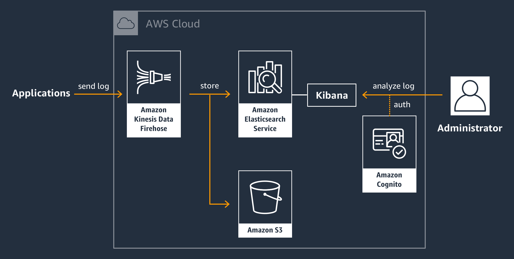

aws-cfn-elasticsearch
---

CloudFormation template for Elasticsearch service with Cognito authentication on AWS


# Architecture



# Deploy

## set up Cognito

1. Deploy Cognito cloudfromation template with Management Console

[](https://console.aws.amazon.com/cloudformation/home?region=ap-northeast-1#/stacks/new?stackName=LogManager-Cognito&templateURL=https://s3.amazonaws.com/midaisuk-public-templates/aws-cfn-elasticsearch/cognito.yaml
)

or with CLI

```bash
aws cloudformation create-stack \
    --stack-name LogManager-Cognito \
    --template-url https://s3.amazonaws.com/midaisuk-public-templates/aws-cfn-elasticsearch/cognito.yaml \
    --capabilities CAPABILITY_IAM \
    --region ap-northeast-1
```

2. add domain to cognito user pool

```bash
aws cognito-idp create-user-pool-domain \
    --user-pool-id {USER_POOL_ID} \
    --domain {IPD_USER_POOL_DOMAIN_NAME} \
    --region ap-northeast-1
```

3. add user for cognito user pool

## set up Elasticsearch

1. Deploy Elasticsearch service cloudfromation template with Management Console

[](https://console.aws.amazon.com/cloudformation/home?region=ap-northeast-1#/stacks/new?stackName=LogManager-ES&templateURL=https://s3.amazonaws.com/midaisuk-public-templates/aws-cfn-elasticsearch/es.yaml
)

or with CLI

```bash
aws cloudformation create-stack \
    --stack-name LogManager-ES \
    --template-url https://s3.amazonaws.com/midaisuk-public-templates/aws-cfn-elasticsearch/es.yaml \
    --parameters \
        ParameterKey=LogBucketName,ParameterValue={BUCKET_NAME} \
        ParameterKey=ElasticsearchDomainName,ParameterValue={ES_DOMAIN_NAME} \
        ParameterKey=ElasticsearchIndexName,ParameterValue={ES_INDEX_NAME} \
        ParameterKey=FirehoseName,ParameterValue={FIREHOSE_NAME} \
    --capabilities CAPABILITY_NAMED_IAM \
    --region ap-northeast-1
```

2. use Cognito user pools for Kibana

```bash
aws es update-elasticsearch-domain-config \
    --domain-name {ES_DOMAIN_NAME} \
    --cognito-options Enabled=true,UserPoolId="{USER_POOL_ID}",IdentityPoolId="{ID_POOL_ID}",RoleArn="{COGNITO_SERVICE_ROLE}" \
    --region ap-northeast-1
```
